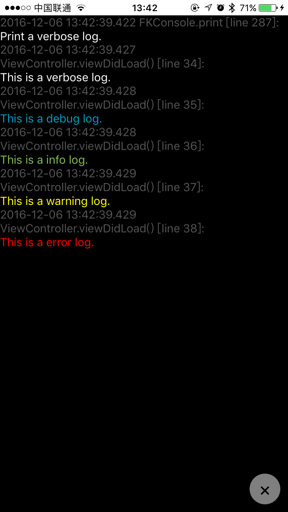

# FKConsole
A convenient console view

## Features
- [x] Easy to use
- [x] Convenient to debug
- [x] Copyable, easy to share
- [x] Don't need to change key window
- [x] Easy to distinguish between different Log Levels
- [x] Log with class and function info, easy to find in project

## Requirment
iOS 8.0 or later  
Swift 3.0 or later

## Install
### Manually
Copy FKConsole.swift to your project  
### CocoaPods
`pod 'FKConsole'`  
There are some problems with namespace, you need import FKConsole when you use Log.  
Also, you can copy the following code to your project, then you can use Log everywhere.
```Swift
import FKConsole

class Log: FKConsole.Log {

}
```

## How to use
First, register FKConsole in AppDelegate.application(_:didFinishLaunchingWithOptions:).  

Register FKConsole with default gesture (Double tap with three fingers to toggle).
```Swift
FKConsole.easyRegister(to: UIWindow)
```
  
Register FKConsole without any gesture, use show() function to show FKConsole in your code.
```Swift
FKConsole.register(to: UIWindow)
```
  
Register FKConsole with custom gestures, the gestures are nullable.
```Swift
FKConsole.register(window: UIWindow, showGesture: UIGestureRecognizer, hideGesture: UIGestureRecognizer)
```

Then you can use these functions to print log.
```Swift
/// Override to intercept print method
/// It's not recommended, please use Log.v(xxx) instead.
/// If you don't want to use this method, please remove it.
public func print(_ items: Any...)

public class Log: NSObject {
    /// Print verbose log (white)
    ///
    /// - parameter log: log content string
    public class func v(_ log: String?, fileName: String = #file, function: String = #function, lineNumber: Int = #line)
    
    /// Print debug log (blue)
    ///
    /// - parameter log: log content string
    public class func d(_ log: String?, fileName: String = #file, function: String = #function, lineNumber: Int = #line)
    
    /// Print info log (green)
    ///
    /// - parameter log: log content string
    public class func i(_ log: String?, fileName: String = #file, function: String = #function, lineNumber: Int = #line)
    
    /// Print warning log (yellow)
    ///
    /// - parameter log: log content string
    public class func w(_ log: String?, fileName: String = #file, function: String = #function, lineNumber: Int = #line)
    
    /// Print error log (red)
    ///
    /// - parameter log: log content string
    public class func e(_ log: String?, fileName: String = #file, function: String = #function, lineNumber: Int = #line)
}
```
### Customize
Set `shouldSaveLogsToDisk` to false to let the FKConsole not to save logs to disk.
```Swift
    /// Default is true, it determines whether to save logs to disk.
    /// If you don't want to save logs to disk, please set it to false.
    public var shouldSaveLogsToDisk: Bool
```
You can also customize the color of diffirent log levels.
```Swift
    /// Color of verbose logs, default is white.
    public var verboseColor: UIColor
    /// Emoji mark of verbose logs, default is ✉️
    public var verboseMark: String
    
    /// Color of debug logs, default is blue.
    public var debugColor: UIColor
    /// Emoji mark of debug logs, default is 🌐
    public var debugMark: String
    
    /// Color of info logs, default is green.
    public var infoColor: UIColor
    /// Emoji mark of info logs, default is 📟
    public var infoMark: String
    
    /// Color of warning logs, default is yellow.
    public var warningColor: UIColor
    /// Emoji mark of warning logs, default is ⚠️
    public var warningMark: String
    
    /// Color of error logs, default is red.
    public var errorColor: UIColor
    /// Emoji mark of error logs, default is ❌
    public var errorMark: String
    
    /// Font of logs, default is system font of 15 pix.
    public var font: UIFont
```

## Example
Warning: print function is not recommended! It won't print class and function where you call `print()`.
```Swift
    print("Print a verbose log.")
    Log.v("This is a verbose log.")
    Log.d("This is a debug log.")
    Log.i("This is a info log.")
    Log.w("This is a warning log.")
    Log.e("This is a error log.")
```
<p>
    
</p>

## License
All source code is licensed under [MIT License](https://github.com/FlyKite/FKConsole/blob/master/LICENSE)
